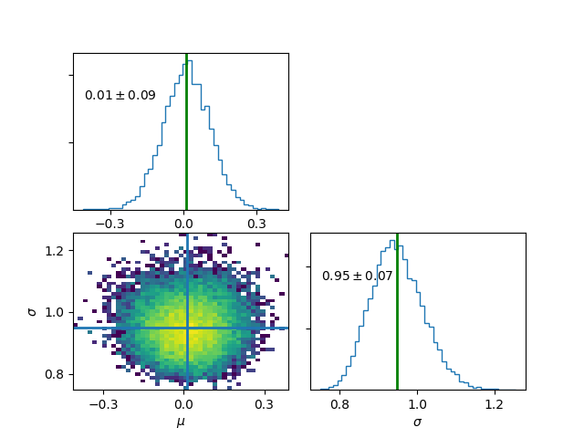
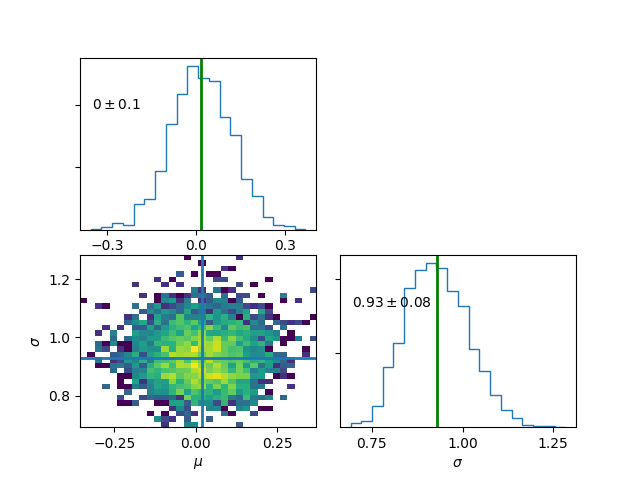
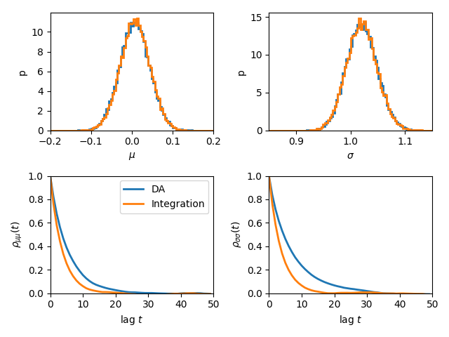
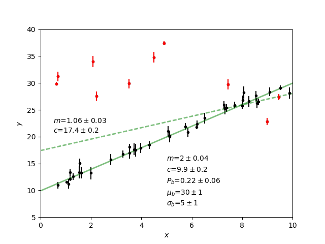
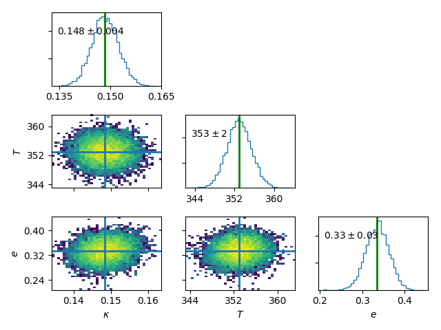
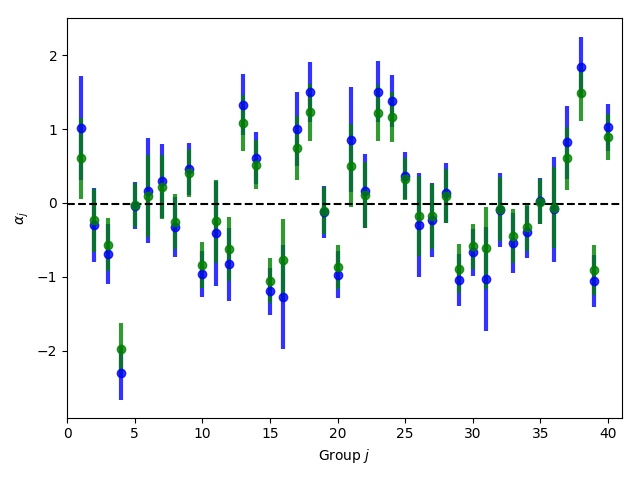

Introduction
-------------
In bmcmc, we fit a statistical model specified by a set of
parameters :math:`\theta` to some data :math:`D`.  Using
MCMCM we sample the posterior :math:`p(\theta|D)`. A
statistical model is specified by defining a subclass derived
from the parent class ``bmcmc.Model`` and 
the user has to write 3 methods for his subclass. We
show this with a simple example.

Fitting a Gaussian distribution 
--------------------------------
A Gaussian or a normal distribution is given by 
:math:`\mathcal{N}(x|\mu,\sigma^2)=\frac{1}{\sqrt{2 \pi}\sigma}\exp\left[-\frac{(x-\mu)^2}{2\sigma^2}\right]`
and we fit this to an array of values representing samples from
a one dimensional distribution.::

    import bmcmc 
    import scipy.stats

    class gauss1(bmcmc.Model):
        def set_descr(self):
            # setup descriptor
	    # self.descr[varname]=[type, value, sigma,     latexname, min_val, max_val]
	    self.descr['mu']     =['l0',   0.0,   1.0,      r'$\mu$',    -500,   500.0]
	    self.descr['sigma']  =['l0',   1.0,   1.0,   r'$\sigma$',  1e-10,      1e3]

        def set_args(self):
            # setup data points 
	    # Use self.args and self.eargs to define your variables. 
	    # During sampling, the code will pass self.args as an argument to lnfunc.  
	    np.random.seed(11)
	    self.args['x']=np.random.normal(loc=0.0,scale=1.0,size=self.eargs['dsize'])

        def lnfunc(self,args):
            # define the function which needs to be sampled (log posterior)
	    # Do not use self.args in this function. You can use self.eargs. 
	    return scipy.stats.norm.logpdf(args['x'],loc=args['mu'],scale=args['sigma'])

Create an object. The ``bmcmc.Model``
accepts a keyword argument named ``eargs`` which should be a
dictionary. In the class, it is available as ``self.eargs``.
Through this keyword one can pass any external information
to the class. 

>>> mymodel=gauss1(eargs={'dsize':50})

Run the sampler for two free parameters, for 50000
iterations, printing summary every 10000 iterations. 

>>> mymodel.sample(['mu','sigma'],50000,ptime=10000)

Print final results, discarding first 10000 iterations

>>> mymodel.info(burn=5000)
no             name         mean      stddev [         16%,          50%,          84%]
Level-0
0               mu    0.0121747    0.0955931 [  -0.0818376,    0.0127852,     0.106895]
1            sigma     0.948579    0.0680425 [    0.880681,     0.944834,      1.01692]

Plot final results , discarding first 5000 iterations

>>> mymodel.plot(burn=5000)

Print chain values for a few given parameters

>>> print mymodel.chain['mu']
>>> print mymodel.chain['sigma']

To print final results as a latex table, discarding the first 5000 iterations.

>>> mymodel.info(burn=5000,latex=True)
\begin{tabular} { l  c} 
Parameter &  16 and 84 \% limits\\ 
\hline 
$\mu$ & $0.01^{+0.09}_{-0.09}$ \\ 
$\sigma$ & $0.95^{+0.07}_{-0.07}$ \\ 
\hline 
\end{tabular} 

Plot final results for specific parameters

>>> mymodel.plot(keys=['mu','sigma'],burn=1000)

.. For a derived class named ``gauss1`` the
   object is instantiated by ::   
    mymodel=gauss1(eargs={'dsize':50})

.. We then run the MCMC sampler.     
   The first argument is the list of parameter names which we
   wish to constrain, the second argument is the number of
   iterations we want to run. The keyword ``ptime`` is the
   frequency (in number of iterations) with which to print
   summary on the screen. :: 
    #mymodel.sample(varnames,iterations,ptime=1000)
    mymodel.sample(['mu','sigma'],10000,ptime=1000)

.. To print final results, discarding the first 1000 iterations. ::
   mymodel.info(burn=1000)

.. To print final results as a latex table, discarding the first 1000 iterations. ::
    mymodel.info(burn=1000, latex=True)

.. To plot results, discarding the first 1000 iterations. ::
   mymodel.plot(burn=1000)

.. To plot results, for specific parameters. ::
   mymodel.plot(keys=['mu','sigma'],burn=1000)

.. To print the MCMC chain for a few given parameters. ::
   print mymodel.chain['m']
   print mymodel.chain['c']

Bayesian hierarchical model (BHM).
-----------------------------------
We again consider the example of fitting a Gaussian
distribution to some observed data. This time the observed
data :math:`x` has uncertainty :math:`\sigma_x` associated
with it. The true values :math:`x_t` is unknown which we 
estimate alongside the parameters of the Gaussian
distribution :math:`\theta=\{ \mu,\sigma\}`.   
The posterior is given by 

.. math:: 
   p(\theta,x_t|x)=\sum_i \mathcal{N}(x_{t,i}|\mu,\sigma^2)\mathcal{N}(x|x_{t,i},\sigma_{x,i}^2). 

The Metropolis-Within-Gibbs  scheme is used for sampling 
the posterior. While :math:`(\mu,\sigma)` are level-0
parameters, :math:`x_t` is at level-1. This makes the model 
hierarchical.  A wide variety of
real world problems fall into this category. This method provides a way to 
marginalize over observational uncertainties via sampling 
but rather than doing any integration. Missing or hidden
variables can also be marginalized in a similar fashion.
::

   class gauss2(bmcmc.Model):
       def set_descr(self):
           # setup descriptor
	   self.descr['mu']     =['l0',0.0,1.0,r'$\mu$'   ,-500,500.0]
	   self.descr['sigma']  =['l0',1.0,1.0,r'$\sigma$',1e-10,1e3]
	   self.descr['xt']     =['l1',0.0,1.0,r'$x_t$'   ,-500.0,500.0]

       def set_args(self):
           # setup data points 
	   np.random.seed(11)
	   # generate true coordinates of data points
	   self.args['x']=np.random.normal(loc=self.eargs['mu'],scale=self.eargs['sigma'],size=self.eargs['dsize'])
	   # add observational uncertainty to each data point
	   self.args['sigma_x']=np.zeros(self.args['x'].size,dtype=np.float64)+0.5
	   self.args['x']=np.random.normal(loc=self.args['x'],scale=self.args['sigma_x'],size=self.eargs['dsize'])

       def lnfunc(self,args):
           # log posterior
	   temp1=scipy.stats.norm.logpdf(args['xt'],loc=args['mu'],scale=args['sigma'])
	   temp2=scipy.stats.norm.logpdf(args['x'],loc=args['xt'],scale=args['sigma_x'])
	   return temp1+temp2

Create an object and run the sampler. 

>>> mymodel=gauss2(eargs={'dsize':100,'mu':1.0,'sigma':2.0})
>>> mymodel.sample(['mu','sigma','xt'],50000,ptime=1000)

Note, for level-1 parameters, 
each data point has its own value for the parameter. 
Rather than storing the full chain, only mean
and standard-deviation for each data point are stored  and
made available. These can be accessed as follows.
To print mean value of ``xt`` for each data point

>>> print mymodel.mu['xt']
[ 1.68764301 -0.191843  ...,  0.80656432  0.47805343]

To print stddev of ``xt`` for each data point

>>> print mymodel.sigma['xt']
[ 0.44846551  0.43683076  ...,  0.44343331  0.44246093]

Print final results. For level-1 parameters the printed
values are just average taken over all data points. 

>>> mymodel.info()
no            name         mean       stddev [         16%,          50%,          84%]
Level-0
0               mu    0.0141504     0.106783 [  -0.0919234,     0.013786,     0.119224]
1            sigma     0.929101    0.0875563 [    0.842694,     0.923683,      1.01629]
Level-1
0               xt    0.0132397     0.441688

>>> mymodel.plot(burn=5000)

Data Augmentation
====================
We can also estimate :math:`\theta=\{\mu,\sigma\}`  by explicitly
integrating out the :math:`x_t`.  The posterior is given by 

.. math:: 
   p(\theta|x)=\sum_i \mathcal{N}(x_i|\mu,\sigma^2+\sigma_{x,i}^2)

Autocorrelation analysis shows that explcit integration
reduces the correlation length. However, not all functions
can be easily integrated.  

::

 class gauss3(bmcmc.Model):
   def set_descr(self):
       # setup descriptor
       self.descr['mu']     =['l0',0.0,1.0,r'$\mu$ ',-500,500.0]
       self.descr['sigma']  =['l0',1.0,1.0,r'$\sigma$ ',1e-10,1e3]

   def set_args(self):
       # setup data points 
       np.random.seed(11)
       # generate true coordinates of data points
       self.args['x']=np.random.normal(loc=self.eargs['mu'],scale=self.eargs['sigma'],size=self.eargs['dsize'])
       # add observational uncertainty to each data point
       self.args['sigma_x']=np.zeros(self.args['x'].size,dtype=np.float64)+0.5
       self.args['x']=np.random.normal(loc=self.args['x'],scale=self.args['sigma_x'],size=self.eargs['dsize'])

   def lnfunc(self,args):
       # log posterior, xt has been integrated out
       sigma=np.sqrt(args['sigma']*args['sigma']+args['sigma_x']*args['sigma_x'])
       temp=scipy.stats.norm.logpdf(args['x'],loc=args['mu'],scale=sigma)
       return temp

  # Data augmentation, making use of Hierarchical modelling
  # marginalization using sampling.
  m2=gauss2(eargs={'dsize':1000,'mu':0.0,'sigma':1.0})
  m2.sample(['mu','sigma','xt'],100000,ptime=10000)
  # Marginalization using direct integration
  m3=gauss3(eargs={'dsize':1000,'mu':0.0,'sigma':1.0})
  m3.sample(['mu','sigma'],100000,ptime=10000)

  plt.subplot(2,2,1)
  plt.hist(m2.chain['mu'],range=[-0.2,0.2],bins=100,normed=True,histtype='step',lw=2.0)
  plt.hist(m3.chain['mu'],range=[-0.2,0.2],bins=100,normed=True,histtype='step',lw=2.0)
  plt.ylabel('p')
  plt.xlabel(r'$\mu$')
  plt.xlim([-0.2,0.2])
  plt.xticks([-0.2,-0.1,0.0,0.1,0.2])

  plt.subplot(2,2,2)
  plt.hist(m2.chain['sigma'],range=[0.85,1.15],bins=100,normed=True,histtype='step',lw=2.0)
  plt.hist(m3.chain['sigma'],range=[0.85,1.15],bins=100,normed=True,histtype='step',lw=2.0)
  plt.ylabel('p')
  plt.xlabel(r'$\sigma$')
  plt.xlim([0.85,1.15])
  plt.xticks([0.9,1.0,1.1])

  plt.subplot(2,2,3)
  nsize=50
  plt.plot(np.arange(nsize),bmcmc.autocorr(m2.chain['mu'])[0:nsize],label='DA',lw=2.0)
  plt.plot(np.arange(nsize),bmcmc.autocorr(m3.chain['mu'])[0:nsize],label='Integration',lw=2.0)
  plt.ylabel(r'$\rho_{\mu \mu}(t)$')
  plt.xlabel(r'lag $t$')
  plt.legend()
  plt.axis([0,50,0,1])

  plt.subplot(2,2,4)
  plt.plot(np.arange(nsize),bmcmc.autocorr(m2.chain['sigma'])[0:nsize],lw=2.0)
  plt.plot(np.arange(nsize),bmcmc.autocorr(m3.chain['sigma'])[0:nsize],lw=2.0)
  plt.ylabel(r'$\rho_{\sigma \sigma}(t)$')
  plt.xlabel(r'lag $t$')
  plt.axis([0,50,0,1])
  plt.tight_layout()

Fitting a straight line with outliers
--------------------------------------
We discuss the case of fitting a
straight line to some data points
:math:`D=\{(x_1,y_1),(x_2,y_2)...(x_N,y_N)\}`.  
The straight line model to decribe the points is

.. math::
   p(y_i| m, c, x_i, \sigma_{y,i}) = \frac{1}{\sqrt{2 \pi}
   \sigma_{y,i}}\exp\left(-\frac{(y_i - mx_i )^2}{2
   \sigma_{y,i}^2}\right) 

The background model to take the outliers into account is 

.. math::
   p(y_i|\mu_b,\sigma_b,x_i,\sigma_{y,i})=\frac{1}{\sqrt{2\pi(\sigma_{y,i}^2+\sigma_b^2)}}\exp\left(-\frac{(y_i-\mu_b)^2}{2 (\sigma_{y,i}^2+\sigma_b^2)}\right)

The full model to describe the data is 

.. math::
   p(Y|m,c,\mu_b,P_b,\sigma_b,X,\sigma_y)=\prod_{i=1}^N [p(y_i|m,c,x_i,\sigma_{y,i})P_b+p(y_i|\mu_b,\sigma_b,x_i,\sigma_{y,i})(1-P_b)]

The methods in the derived class for implementing the
straight line model are as follows. ::

  class stlineb(bmcmc.Model):
    def set_descr(self):
        # setup descriptor
        self.descr['m']      =['l0', 1.0, 0.2,'$m$',        -1e10,1e10]
        self.descr['c']      =['l0',10.0, 1.0,'$c$',        -1e10,1e10]
        self.descr['mu_b']   =['l0', 1.0, 1.0,'$\mu_b$',    -1e10,1e10]
        self.descr['sigma_b']=['l0', 1.0, 1.0,'$\sigma_b$', 1e-10,1e10]
        self.descr['p_b']    =['l0',0.1,0.01,'$P_b$',      1e-10,0.999]

    def set_args(self):
        # setup data points 
        np.random.seed(11)
        self.args['x']=0.5+np.random.ranf(self.eargs['dsize'])*9.5
        self.args['sigma_y']=0.25+np.random.ranf(self.eargs['dsize'])
        self.args['y']=np.random.normal(self.args['x']*2+10,self.args['sigma_y'])
        # add outliers
        self.ind=np.array([0,2,4,6,8,10,12,14,16,18])
        self.args['y'][self.ind]=np.random.normal(30,5,self.ind.size)
        self.args['y'][self.ind]=self.args['y'][self.ind]+np.random.normal(0.0,self.args['sigma_y'][self.ind])

    def lnfunc(self,args):
        # log posterior
        if self.eargs['outliers'] == False:
            temp1=(args['y']-(self.args['m']*self.args['x']+self.args['c']))/args['sigma_y']
            return -0.5*(temp1*temp1)-np.log(np.sqrt(2*np.pi)*args['sigma_y'])
        else:
            temp11=scipy.stats.norm.pdf(args['y'],loc=(self.args['m']*self.args['x']+self.args['c']),scale=args['sigma_y'])
            sigma_b=np.sqrt(np.square(args['sigma_y'])+np.square(args['sigma_b']))
            temp22=scipy.stats.norm.pdf(args['y'],loc=self.args['mu_b'],scale=sigma_b)
            return np.log((1-args['p_b'])*temp11+args['p_b']*temp22)

    def myplot(self,chain): 
       # optional method for plotting
       # plot best fit line corrsponding to chain of this model
        plt.clf()
        x = np.linspace(0,10)
        burn=self.chain['m'].size/2
        vals=self.best_fit(burn=burn)
        plt.errorbar(self.args['x'], self.args['y'], yerr=self.args['sigma_y'], fmt=".k")
        plt.errorbar(self.args['x'][self.ind], self.args['y'][self.ind], yerr=self.args['sigma_y'][self.ind], fmt=".r")
        plt.plot(x,vals[0]*x+vals[1], color="g", lw=2, alpha=0.5)
        for i,key in enumerate(self.names0):
            print key
            plt.text(0.5,0.3-i*0.06,self.descr[key][3]+'='+bmcmc.stat_text(self.chain[key][burn:]),transform=plt.gca().transAxes)

       # plot best fit line corrsponding to some other chain
        vals1=[]
        burn1=chain['m'].size/2
        for i,key in enumerate(['m','c']):
            print key
            plt.text(0.05,0.5-i*0.05,self.descr[key][3]+'='+bmcmc.stat_text(chain[key][burn1:]),transform=plt.gca().transAxes)
            vals1.append(np.mean(chain[key][burn1:]))
        plt.plot(x,vals1[0]*x+vals1[1], 'g--', lw=2, alpha=0.5)
        plt.xlabel(r'$x$')
        plt.ylabel(r'$y$')
        plt.axis([0,10,5,40,])

>>> model1=stlineb(eargs={'dsize':50})

Run without any model for outliers

>>> model1.eargs['outliers']=False
>>> model1.sample(['m','c'],10000)
>>> chain1=model1.chain

Run with a model for outliers  

>>> model1.eargs['outliers']=True
>>> model1.sample(['m','c','p_b','mu_b','sigma_b'],20000)

Plot the results. Expected values are (m, c, p_b , mu_b, sigma_b)=(2.0, 10.0, 0.2, 30, 5.0)

>>>  model1.myplot(chain1)

Analysis of a binary system using radial velocity measurement
---------------------------------------------------------------
The radial velocity of a star of mass :math:`M` in a binary system
with companion of mass :math:`m` in an orbit with time period
:math:`T` and eccentricity :math:`e` is given by

.. math:: 
   v(t)=\kappa \left[\cos(f+\omega)+e\cos \omega\right]+v_{0},\:\:{\rm with\ } \kappa=\frac{(2\pi G)^{1/3}m \sin I}{T^{1/3}(M+m)^{2/3}\sqrt{1-e^2}}.

The true anomaly :math:`f` is a function of time, but depends upon :math:`e`,
:math:`T`, and :math:`\tau` via, 

.. math:: 
   \tan(f/2)=\sqrt{\frac{1+e}{1-e}}\tan(u/2), \quad  u-e\sin u=\frac{2\pi}{T}(t-\tau).

The actual radial velocity data will differ from the 
perfect relationship given above  due to the 
observational uncertainty (variance :math:`\sigma_v^2`) and 
intrinsic variability of a star (variance :math:`S^2`) and we can
model this by a Gaussian function
:math:`\mathcal{N}(.|v,\sigma_v^2+S^2)`. 
For radial velocity data :math:`D` defined as a set of
radial velocities :math:`\{v_1,...,v_M\}` at various
times :math:`\{t_1,...,t_M\}`, one can fit and constrain seven 
parameters,  :math:`\theta=(v_{0}, \kappa, T, e, \tau, \omega, S)`,
using the Bayes theorem as shown below   

.. math::
   p(\theta|D)=p(D|\theta) p(\theta)= p(\theta) \prod_{i=1}^{M} \mathcal{N}(v_i|v(t_i;\theta),\sigma_v^2+S^2).

We implement this as shown below.
::

 # functions for computing the radial velocity curve
 def true_anomaly(t,tp,e,tau):
    temp1=np.min((t-tau)/tp)-1
    temp2=np.max((t-tau)/tp)+1
    u1=np.linspace(2*np.pi*temp1,2*np.pi*temp2,1000)
    ma=u1-e*np.sin(u1)
    myfunc=scipy.interpolate.interp1d(ma,u1)
    u=myfunc((2*np.pi)*(t-tau)/tp)
    return 2*np.arctan(np.sqrt((1+e)/(1-e))*np.tan(0.5*u))

 def kappa(t,e,m,mc,i):
    au_yr=4.74057 # km/s
    G=4*np.pi*np.pi*np.power(au_yr,3.0) # [km/s]^{3}*[yr]^{-1}*[M_sol]
    nr=np.power(2*np.pi*G,1/3.0)*mc*np.sin(np.radians(i))
    dr=np.power(t/365.0,1/3.0)*np.power(m+mc,1/3.0)*np.sqrt(1-e*e)
    return nr/dr

 def vr(t,kappa,tp,e,tau,omega,v0):
    omega=np.radians(omega)
    f=true_anomaly(t,tp,e,tau)
    return kappa*(np.cos(f+omega)+e*np.cos(omega))+v0

 # model for describing a binary system
 class binary_model(bmcmc.Model):
    def set_descr(self):
        # setup descriptor
        self.descr['kappa']     =['p',0.1,0.1,r'$\kappa$ ',1e-10,10.0]
        self.descr['tp']  =['p',365.0,10.0,r'$T$ ',1e-10,1e6]
        self.descr['e']      =['p',0.5,0.1,r'$e$ ',0,1.0]
        self.descr['tau']     =['p',50.0,10.0,r'$\tau$ ',-360.0,360.0]
        self.descr['omega']=['p',180.0,10.0,r'$\omega$ ',-360,360.0]
        self.descr['v0']=['p',0.0,1.0,r'$v_0$ ',-1e3,1e3]
        self.descr['s']=['p',0.02,1.0,r'$\sigma$ ',1e-10,1e3]

    def set_args(self):
        # setup data points 
        np.random.seed(17)
        kappa=0.15
        tp=350.0
        e=0.3
        tau=87.5
        omega=-90.0
        v0=0.0
        print tau,omega
        
        self.args['t']=np.linspace(0,self.args['tp']*1.5,self.eargs['dsize'])
        vr1=vr(self.args['t'],kappa,tp,e,tau,omega,v0)
        self.args['vr']=vr1+np.random.normal(0.0,self.args['s'],size=self.eargs['dsize'])
    

    def lnfunc(self,args):
        vr1=vr(args['t'],args['kappa'],args['tp'],args['e'],args['tau'],args['omega'],args['v0'])
        temp=-np.square(args['vr']-vr1)/(2*args['s']*args['s'])-np.log(np.sqrt(2*np.pi)*args['s'])
        return temp

Create an object of the model.

>>> m1=binary_model(eargs={'dsize':50})

Run the sampler.

>>> m1.sample(['kappa','tp','e','tau','omega','v0'],50000,ptime=10000)

Plot the results.

>>> plt.figure()
>>> m1.plot(keys=['kappa','tp','e'],burn=10000)

Plot the best fit model. 
::

 res=m1.best_fit()
 args=m1.args
 t=np.linspace(0,np.max(m1.args['t']),1000)
 plt.figure()
 plt.errorbar(args['t'],args['vr'],yerr=args['s'],fmt='o',label='data')
 plt.plot(t,vr(t,res[0],res[1],res[2],res[3],res[4],res[5]),label='best fit',lw=2.0)
 plt.plot(t,vr(t,res[0],res[1],0.0,res[3],res[4],res[5]),'r--',label='e=0.0',lw=1.0)
 plt.title(r'$\kappa=0.15$ km/s, $T=350$ days, $e=0.3$, $\omega=-90.0^{\circ}$, $\tau=87.5$ days')
 plt.xlabel('Time (days)')
 plt.ylabel('radial velocity (km/s)')
 plt.legend(loc='lower left',frameon=False)
 plt.axis([0,600,-0.35,0.35])

.. figure:: images/rv_mcmc.png 

Group means
------------
Given data :math:`Y=\{y_{ij}|0<j<J,o<i<n_j\}` grouped into
:math:`J` independent groups, we want to find the group mean
:math:`\alpha_j` and the distribution of group means
modelled as :math:`\mathcal{N}(\alpha|\mu,\omega^2)`. 
The posterior we wish to sample is  

.. math::
   p(\alpha,\mu, \omega|Y)=p(Y|\alpha,\sigma)p(\alpha|\mu,\omega)p(\mu,\omega)
   = p(\mu,\omega)\sum_{j=1}^{J} p(\alpha_j,|\mu,\omega) \sum_{i=1}^{n_j}p(y_{ij}|\alpha_j,\sigma).
 
::

  class gmean(bmcmc.Model):
    def set_descr(self):
        # Setup descriptor.
        self.descr['alpha']   =['l1',0.0,1.0,r'$\alpha$',-1e10,1e10]
        self.descr['mu']      =['l0',1.0,1.0,r'$\mu$'   ,-1e10,1e10]
        self.descr['omega']   =['l0',1.0,1.0,r'$\omega$',1e-10,1e10]

    def set_args(self):
        # Create data points.
        np.random.seed(11)
        self.eargs['mu']=0.0
        self.eargs['omega']=1.0
        self.eargs['sigma']=1.0

        self.data={}
        self.data['y']=[]
        self.data['gsize']=np.array([2,4,6,8,10]*(self.eargs['dsize']/5))
        self.data['gmean']=np.random.normal(self.eargs['mu'],self.eargs['omega'],size=self.data['gsize'].size)
        for i in range(self.data['gsize'].size):
            self.data['y'].append(np.random.normal(self.data['gmean'][i],self.eargs['sigma'],size=self.data['gsize'][i]))

    def lnfunc(self,args):
       # log posterior
        temp1=[]
        for i,y in enumerate(self.data['y']):
            temp1.append(np.sum(self.lngauss(y-args['alpha'][i],self.eargs['sigma'])))
        temp1=np.array(temp1)
        temp2=scipy.stats.norm.logpdf(args['alpha'],loc=args['mu'],scale=args['omega'])
        return temp1+temp2

    def myplot(self):
        # Plot the results
        plt.clf()
        burn=1000
        x=np.arange(self.eargs['dsize'])+1
        stats=[[],[]]
        for i,y in enumerate(self.data['y']):
            stats[0].append(np.mean(y))
            stats[1].append(self.eargs['sigma']/np.sqrt(y.size))
        plt.errorbar(x,stats[0],yerr=stats[1],fmt='.b',lw=3,ms=12,alpha=0.8) 
        plt.errorbar(x,self.mu['alpha'],yerr=self.sigma['alpha'],fmt='.g',lw=3,ms=12,alpha=0.8)

        temp1=np.mean(self.chain['mu'][burn:])
        plt.plot([0,self.eargs['dsize']+1],[temp1,temp1],'k--')
        plt.xlim([0,self.eargs['dsize']+1])
        plt.ylabel(r'$\alpha_j$')
        plt.xlabel(r'Group $j$')

Run and plot

>>> m1=gmean(eargs={'dsize':40})
>>> m1.sample(['mu','omega','alpha'],10000)
>>> m1.myplot()

Extra details
---------------
To better understand as to how the code works, it is
instructive to look at the  ``__init__`` method of ``bmcmc.Model``. It
creates the dictionaries ``self.descr`` and ``self.args`` so
the user does not have to create them. It then 
calls ``self.set_descr()``. After this it initializes all level-0 parameters  
in ``self.args``  to values from ``self.descr``.  So
parameters of the model that are to be kept free do not need to be
initialized.  The user can reinitialize them
``set_args`` which is called next. 
If ``self.eargs['dsize']`` , which  is the number
of data points, has not been set earlier, it  must be
specified in ``set_args``. Any level-1 parameter that
is not initialized in ``set_args``, is done using values
from ``self.descr``.  :: 

    def __init__(self,eargs=None):
        self.eargs=eargs        
        self.args={}
        self.descr={}
        self.set_descr()
        for name in self.descr.keys():
            if (self.descr[name][0]=='l0'):
                self.args[name]=np.float64(self.descr[name][1])
        self.set_args()
        for name in self.descr.keys():
            if (self.descr[name][0]=='l1'):
                if name not in self.args.keys(): 
                    self.args[name]=np.zeros(self.eargs['dsize'],dtype=np.float64)+self.descr[name][1]

..
   * ``set_descr``: This sets the dictionary ``self.descr`` that describes the parameters :math:`\theta` of the
     model.::

	   def set_descr(self):
	       #self.descr[name]    =[level, value, sigma,   latex_name, value_min, value_max]  
	       self.descr['m']      =['l0',    1.0,   0.2,	       '$m$',     -1e10,     1e10]
	       self.descr['c']      =['l0',   10.0,   1.0,	      '$c$' ,     -1e10,     1e10]
	       self.descr['mu_b']   =['l0',    1.0,   1.0,	   '$\mu_b$',     -1e10,     1e10]
	       self.descr['sigma_b']=['l0',    1.0,   1.0,	'$\sigma_b$',     1e-10,     1e10]
	       self.descr['p_b']    =['l0',   0.15,  0.01,	     '$P_b$',     1e-10,    0.999]
	       self.descr['x']      =['l1',    0.0,   1.0,	       '$x$',    -500.0,    500.0]
	       self.descr['sigma_y']=['l1',    1.0,   1.0,	'$\sigma_x$',     1e-10,      1e3]
	       self.descr['y']      =['l1',    0.0,   1.0,	      '$y$' ,    -500.0,    500.0]

     For a hierarchical model parameters can exist at various
     levels. We have two options to choose from ``l0`` (top
     level for example hyper-parameters) or  ``l1`` (the level below it).  

   * ``set_args``: This sets the dictionary ``self.args`` that specifies the data :math:`D` to be used by
     the model. Any parameters :math:`\theta` or variables that will be used to
     compute the posterior, should be initialized
     here. The dictionary  itself is already defined in
     ``__init__`` method, which also initializes all level-0 parameters  
     to values from ``self.descr``. The user can reset 
     them if needed. If not set earlier the number
     of data points must be specified by assigning a
     value to  ``self.eargs['dsize']``. If any level-1 parameter is not initialized
     , the base class will attempt to initialize it from
     ``self.descr``.   :: 

	    def set_args(self):
		# The dict self.args is already defined and all level-0
		# parameters have been initialized to values from self.descr
		np.random.seed(11)
		self.args['x']=0.5+np.random.ranf(self.eargs['dsize'])*9.5
		self.args['sigma_y']=0.25+np.random.ranf(self.eargs['dsize'])
		# Generate data satisfying y=mx+c+e
		self.args['y']=np.random.normal(self.args['x']*2+10,self.args['sigma_y'])
		# add outliers
		self.ind=np.array([0,2,4,6,8,10,12,14,16,18])
		self.args['y'][self.ind]=np.random.normal(30,5,self.ind.size)
		# add error to outliers
		self.args['y'][self.ind]=self.args['y'][self.ind]+np.random.normal(0.0,self.args['sigma_y'][self.ind])

   * ``lnfunc(self,args)``: This is for specifying the
     posterior probability :math:`p(\theta|D)` that we want to
     sample using MCMC. This should be an
     array of size ``self.eargs['dsize']``, i.e., posterior for
     each data point. ::

	   def lnfunc(self,args):
	       # likelihood of the  straight line model
	       temp1=(args['y']-(self.args['m']*self.args['x']+self.args['c']))/args['sigma_y']
	       temp1=temp1.clip(max=30.0)
	       temp11=(1-args['p_b'])*np.exp(-0.5*temp1*temp1)/(np.sqrt(2*np.pi)*args['sigma_y'])
	       # likelihood of the outlier model
	       sigma_b=np.sqrt(np.square(args['sigma_y'])+np.square(args['sigma_b']))
	       temp2=(args['y']-self.args['mu_b'])/sigma_b
	       temp2=temp2.clip(max=30.0)
	       temp22=args['p_b']*np.exp(-0.5*temp2*temp2)/(np.sqrt(2*np.pi)*sigma_b)
	       # full log likelihood 
	       return np.log(temp11+temp22)

   A full class for the model is as follows::

       class stlineb(bmcmc.Model):
	   def set_descr(self):
	       self.descr['m']      =['l0', 1.0, 0.2,'$m$',       -1e10,1e10]
	       self.descr['c']      =['l0',10.0, 1.0,'$c$',       -1e10,1e10]
	       self.descr['mu_b']   =['l0', 1.0, 1.0,'$\mu_b$',   -1e10,1e10]
	       self.descr['sigma_b']=['l0', 1.0, 1.0,'$\sigma_b$',1e-10,1e10]
	       self.descr['p_b']    =['l0',0.15,0.01,'$P_b$',     1e-10,0.999]
	       self.descr['x']      =['l1', 0.0, 1.0,'$x$',       -500.0,500.0]
	       self.descr['sigma_y']=['l1', 1.0, 1.0,'$\sigma_x$',1e-10,1e3]
	       self.descr['y']      =['l1', 0.0, 1.0,'$y$',       -500.0,500.0]

	    def set_args(self):
		np.random.seed(11)
		self.args['x']=0.5+np.random.ranf(self.eargs['dsize'])*9.5
		self.args['sigma_y']=0.25+np.random.ranf(self.eargs['dsize'])
		self.args['y']=np.random.normal(self.args['x']*2+10,self.args['sigma_y'])
		self.ind=np.array([0,2,4,6,8,10,12,14,16,18])
		self.args['y'][self.ind]=np.random.normal(30,5,self.ind.size)
		self.args['y'][self.ind]=self.args['y'][self.ind]+np.random.normal(0.0,self.args['sigma_y'][self.ind])

	   def lnfunc(self,args):
	       temp1=(args['y']-(self.args['m']*self.args['x']+self.args['c']))/args['sigma_y']
	       sigma_b=np.sqrt(np.square(args['sigma_y'])+np.square(args['sigma_b']))
	       temp2=(args['y']-self.args['mu_b'])/sigma_b
	       temp1=temp1.clip(max=30.0)
	       temp2=temp2.clip(max=30.0)
	       temp11=(1-args['p_b'])*np.exp(-0.5*temp1*temp1)/(np.sqrt(2*np.pi)*args['sigma_y'])
	       temp22=args['p_b']*np.exp(-0.5*temp2*temp2)/(np.sqrt(2*np.pi)*sigma_b)
	       return np.log(temp11+temp22)

	   def myplot(self):
	       plt.clf()
	       x = np.linspace(0,10)
	       plt.errorbar(self.args['x'], self.args['y'], yerr=self.args['sigma_y'], fmt=".k")
	       plt.errorbar(self.args['x'][self.ind], self.args['y'][self.ind], yerr=self.args['sigma_y'][self.ind], fmt=".r")
	       plt.plot(x,vals[0]*x+vals[1], color="g", lw=2, alpha=0.5)
	       plt.xlabel(r'$x$')
	       plt.ylabel(r'$y$')

   Hierarchical model using MWG
   ----------------------------

   Exoplanets and binary system  
   ----------------------------
